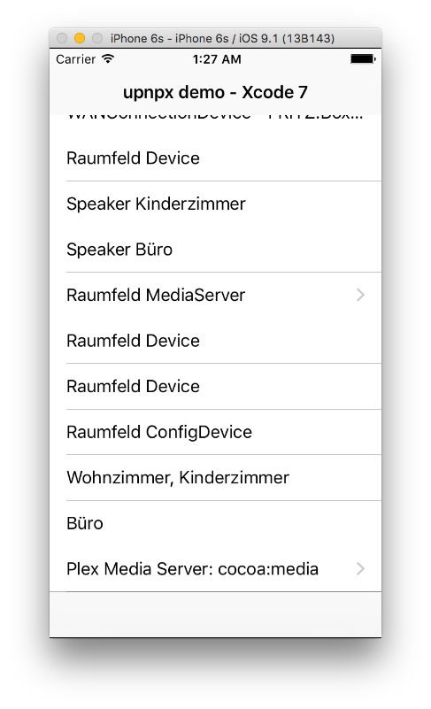
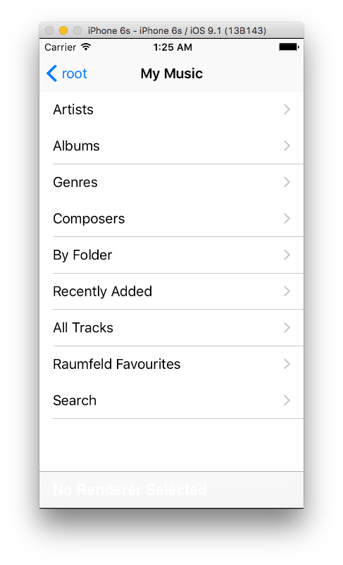

[Description](description.md) ← [Home](../) → [Eventing](eventing.md)

# upnpx Tutorial
## 4. Control

> UPnP specifications: _"Through control, control points invoke actions on devices and poll for values."_

This is an interesting step since we actually will read and set device properties. For [`MediaServer1Device`](../../src/api/MediaServer1Device.h) devices we will be able to query the media on the device in different ways, browse, search, get icons etc. For [`MediaRenderer1Device`](../../src/api/MediaRenderer1Device.h) devices we will have methods to play content, pause, change volume etc. 

The exact capabilities for a device are defined by the UPnP Standard or by the vendor, **upnpx** provide an Objective-C interface for such specified service functions. 
<br><br> 

### Example: MediaServer1Device

This section demonstrates how to write a MediaServer control in order to browse its media data.

Screenshots taken from the [Xcode 7 Example Project](https://github.com/phranck/upnpx/tree/master/projects/xcode7).




The first thing to do is to take a look at the `MediaServer1Device` specifications, which are described in [MediaServer:1 Device Template](http://upnp.org/specs/av/UPnP-av-MediaServer-v1-Device.pdf).

UPnP devices expose Actions and Events through services, so you need to find and choose the desired Service Type that offers the functionality you want to achieve.

For our example `MediaServer1Device` the supported Service Types are listed under _"2.2 Device Model"_. These are:

* [ContentDirectory:1](http://upnp.org/specs/av/UPnP-av-ContentDirectory-v1-Service.pdf)
* [ConnectionManager:1](http://upnp.org/specs/av/UPnP-av-ConnectionManager-v1-Service.pdf)
* [AVTransport:1](http://upnp.org/specs/av/UPnP-av-AVTransport-v1-Service.pdf)

After examining the specifications you will see that the [ContentDirectory:1](http://upnp.org/specs/av/UPnP-av-ContentDirectory-v1-Service.pdf) service offers an Action, under *_"2.7.4. Browse"_, to browse the data on a device.  

The *Browse* action defines a set of input and output parameters, read the specifications to understand their meaning. **upnpx** implements the *Browse* action  (as well as all other Actions) with the exact same parameters. The usage of the parameters is defined by the specifications.

Now we decided we need access to the *Browse* Action, we need to find out how to achieve this in **upnpx**. Well, like the other things, it is not too difficult, call it easy.

* First you need the [`MediaServer1Device`](../../src/api/MediaServer1Device.h) pointer you got from Step 3 of the tutorial: [Description](description.md)  
```Objective-C
BasicUPnPDevice *device = [mDevices objectAtIndex:indexPath.row];
    if([[device urn] isEqualToString:@"urn:schemas-upnp-org:device:MediaServer:1"]){
        MediaServer1Device *server = (MediaServer1Device*)device;
        //We are ready to call control-methods on the server device
    }
```
* The [`MediaServer1Device`](../../src/api/MediaServer1Device.h) defines 3 properties to access the Services. 
```Objective-C
@property (NS_NONATOMIC_IOSONLY, readonly, strong) SoapActionsAVTransport1 *avTransport;
@property (NS_NONATOMIC_IOSONLY, readonly, strong) SoapActionsConnectionManager1 *connectionManager;
@property (NS_NONATOMIC_IOSONLY, readonly, strong) SoapActionsContentDirectory1 *contentDirectory;
```  
Use the one you need, in our case it is ```[mediaServerDevice contentDirectory]```

* Call the desired Actions. All actions defined in [ContentDirectory:1](http://upnp.org/specs/av/UPnP-av-ContentDirectory-v1-Service.pdf) are available as Methods in the [`SoapActionsContentDirectory1.h`](../../src/api/SoapActionsContentDirectory1.h) class.

In our case we want to use the, somewhat complexer, *BrowseWithObjectID* Action. Note that upnpx follows the Objective-C conventions and add the name of the first argument as a postfix to the method (Action) name : *Browse _WithObjectID_*
```Objective-C
-(int)BrowseWithObjectID:(NSString*)objectid BrowseFlag:(NSString*)browseflag Filter:(NSString*)filter StartingIndex:(NSString*)startingindex RequestedCount:(NSString*)requestedcount SortCriteria:(NSString*)sortcriteria OutResult:(NSMutableString*)result OutNumberReturned:(NSMutableString*)numberreturned OutTotalMatches:(NSMutableString*)totalmatches OutUpdateID:(NSMutableString*)updateid;
```

This code example is an extract of [`FolderViewController.m`](../../projects/xcode7/upnpxdemo/upnpxdemo/FolderViewController.m#L55-L61) from the [Xcode 7 project](../../projects/xcode7/upnpxdemo) that demonstrates how to handle the input and output parameters (the output parameters need to be of the type `NSMutableString`, when the function returns they contain the requested data):
```Objective-C
//Allocate NSMutableString's to read the results
NSMutableString *outResult = [[NSMutableString alloc] init];
NSMutableString *outNumberReturned = [[NSMutableString alloc] init];
NSMutableString *outTotalMatches = [[NSMutableString alloc] init];
NSMutableString *outUpdateID = [[NSMutableString alloc] init];
    
[[m_device contentDirectory] BrowseWithObjectID:m_rootId BrowseFlag:@"BrowseDirectChildren" Filter:@"*" StartingIndex:@"0" RequestedCount:@"0" SortCriteria:sortCriteria OutResult:outResult OutNumberReturned:outNumberReturned OutTotalMatches:outTotalMatches OutUpdateID:outUpdateID];
    ...
```

All Actions for all services work in a similar way. Mostly it is enough to call them with the right parameters (check the specs for that) and the device will act on your commands.

For this demo, the *Browse* Action returns a somewhat complicated result in *outResult* in the form of _DIDL XML_. **upnpx** has some helper code to parse that DIDL result into an array with usable objects: 

```Objective-C
@interface FolderView : UITableViewController {
    ...
    NSMutableArray *m_playList; 
}

- (void)viewDidLoad {
    [super viewDidLoad];
    
    // Before we do anything, some devices do not support sorting and will fail if we try to sort on our request
    NSString *sortCriteria = @"";
    NSMutableString *outSortCaps = [[NSMutableString alloc] init];
    [[m_device contentDirectory] GetSortCapabilitiesWithOutSortCaps:outSortCaps];
    
    if ([outSortCaps rangeOfString:@"dc:title"].location != NSNotFound)
    {
        sortCriteria = @"+dc:title";
    }

    //Allocate NMSutableString's to read the results
    NSMutableString *outResult = [[NSMutableString alloc] init];
    NSMutableString *outNumberReturned = [[NSMutableString alloc] init];
    NSMutableString *outTotalMatches = [[NSMutableString alloc] init];
    NSMutableString *outUpdateID = [[NSMutableString alloc] init];
    
    [[m_device contentDirectory] BrowseWithObjectID:m_rootId BrowseFlag:@"BrowseDirectChildren" Filter:@"*" StartingIndex:@"0" RequestedCount:@"0" SortCriteria:sortCriteria OutResult:outResult OutNumberReturned:outNumberReturned OutTotalMatches:outTotalMatches OutUpdateID:outUpdateID];
//    SoapActionsAVTransport1* _avTransport = [m_device avTransport];
//    SoapActionsConnectionManager1* _connectionManager = [m_device connectionManager];
    
    //The collections are returned as DIDL Xml in the string 'outResult'
    //upnpx provide a helper class to parse the DIDL Xml in usable MediaServer1BasicObject object
    //(MediaServer1ContainerObject and MediaServer1ItemObject)
    //Parse the return DIDL and store all entries as objects in the 'mediaObjects' array
    [m_playList removeAllObjects];
    NSData *didl = [outResult dataUsingEncoding:NSUTF8StringEncoding]; 
    MediaServerBasicObjectParser *parser = [[MediaServerBasicObjectParser alloc] initWithMediaObjectArray:m_playList itemsOnly:NO];
    [parser parseFromData:didl];

...

}
```


Please check the [`FolderViewController.m`](../../projects/xcode7/upnpxdemo/upnpxdemo/FolderViewController.m) for the full implementation. 


[Description](description.md) ← [Home](../) → [Eventing](eventing.md)